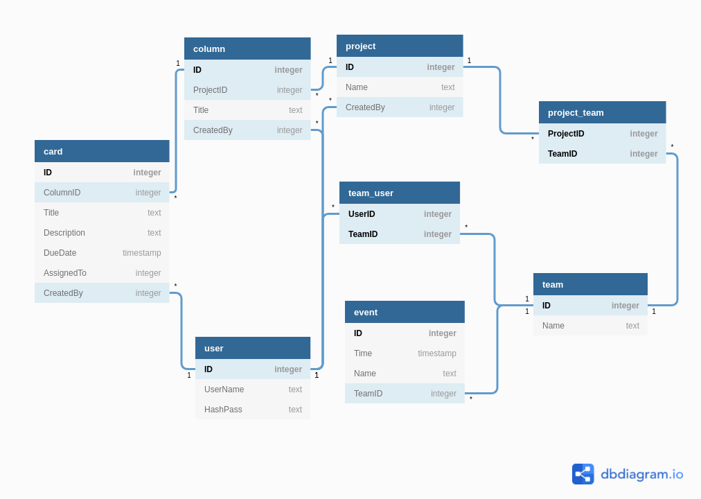
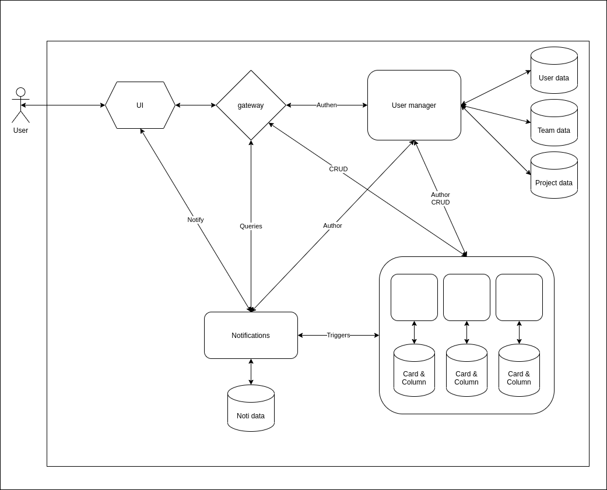
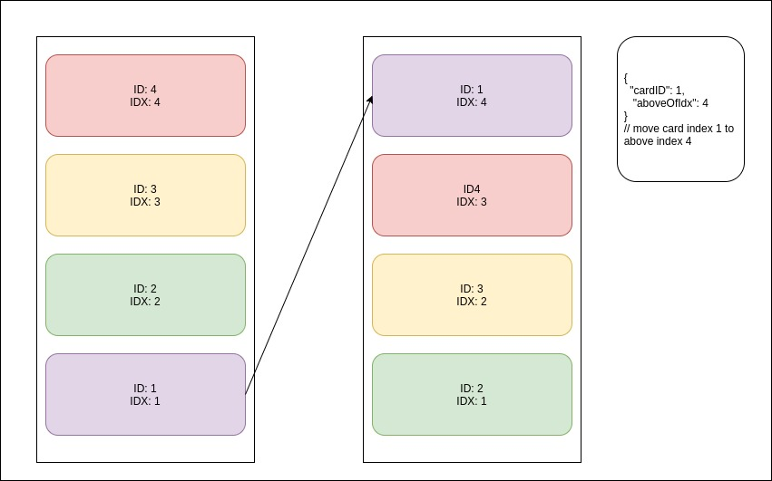
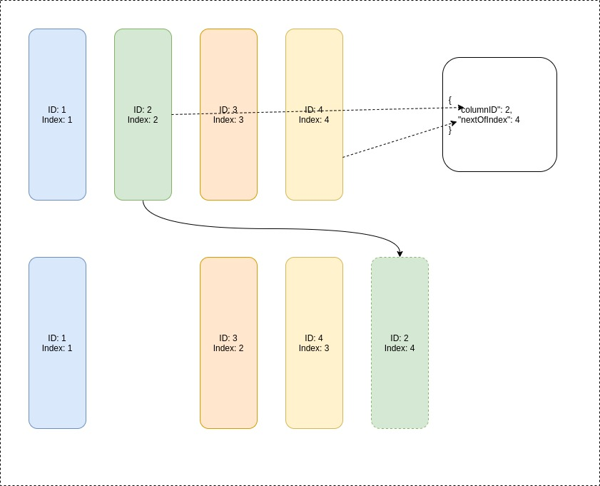

# prom
Project Management. HUST_20202_DS

# Project folders

1. Golang
   1. cmd: for specified apps
   2. pkg: shared packages  
2. web: web resources
3. docs: documentation

## DB desgin

## System design

- NOTE: Nofications will be developed if there is enough time

## DEVELOPMENT

1. Postman Collection: https://www.getpostman.com/collections/654a270d5382abd97404

2. SwaggerUI: http://127.0.0.1:12345/docs/index.html

3. Reorder cards
   1. Reorder in 1 column
      - Specify card id(1)
      - index of card(2) that you want to set card(1) above of it.
  
   2. Reorder card between column
      - Specify card id(1)
      - Specify column id that you want to move card(1) to.
      - index of card(2) that you want to set card(1) above of it.

   3. Example
      - 
      - 